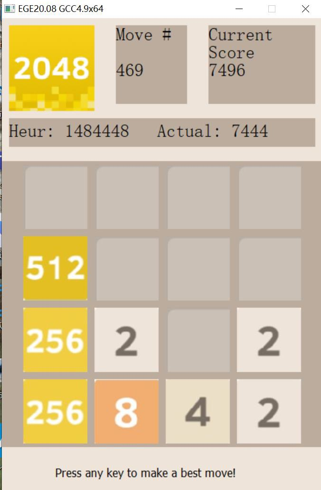

# AI Driven 2048 Game
 
 ## Project Overview
This project involves the development of an AI for the popular 2048 game using the expectimax optimization algorithm. The AI is designed to achieve the highest possible scores. Additionally, the project includes modes for achieving the lowest possible scores and playing against human players. This README provides an overview of the project's features, methodologies, and results.

## Key Features
- **Expectimax Optimization**: Implements expectimax search to evaluate the best possible moves by considering the probabilities of future tile placements.
- **Heuristics**: Utilizes multiple heuristics to guide the AI's decisions, including bonuses for open tiles and high-value tiles on the edges, and penalties for non-monotonic rows and columns.
- **Bit Manipulations**: Employs bit manipulation techniques for efficient game board representation and operations.
- **Graphics Integration**: Integrates the Easy Graphics Engine (EGE) for a visual representation of the game, enhancing user interaction and experience.

## Project Structure
- **src**: Contains the source code files.
  - `2048.h`: Header file with definitions, constants, and declarations.
  - `config.h`: Configuration settings and constants.
  - `main.cpp`: Main source file with the primary game logic.
  - `Makefile.win`: Makefile for building the project on Windows.
  - `mode 2.dev`, `mode 2.layout`, `mode 3.dev`, `mode 3.layout`: Configuration and layout files for different modes.
  - `platdefs.h`: Platform-specific definitions and macros.

## Methodologies
- **Expectimax Optimization**: Used instead of the traditional minimax algorithm to evaluate the best possible moves considering the probabilities of future tile placements.
- **Heuristics**: Includes bonuses for open tiles and high-value tiles on the edges, and penalties for non-monotonic rows and columns.
- **Bit Manipulation**: Techniques for efficient board representation and operations, enhancing computation speed.
- **Graphics**: Utilized the Easy Graphics Engine (EGE) for visual representation.

## Performance Evaluation
- **Success Rates**: Achieved 100% success rate for reaching tiles up to 16384, with a 36% probability of reaching 32768.
- **Time Efficiency**: Demonstrated significant performance improvements with an average time of 403.3149 seconds to reach the 2048 tile.
- **Low Score Mode**: Successfully achieved lower scores in a dedicated mode designed for minimizing the score.
- **AI vs. Player Mode**: Implemented a mode where the AI plays against human players, aiming to achieve low scores while the player tries to maximize the score.

## Game UI

